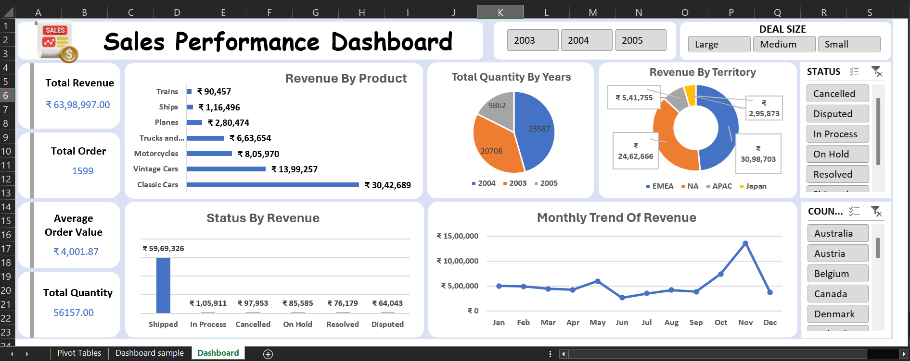

# 📊 Global Sales Performance Analysis

## 🚀 Project Overview

An interactive business intelligence project developed using Microsoft Excel and Power BI to analyze global sales performance, product trends, regional contribution, and geographical business insights.

This project demonstrates practical skills in:

* Data Cleaning & Transformation
* Dashboard Design
* KPI Reporting
* DAX Calculations
* Business Analysis
* Data Storytelling
* Insight Generation

The dashboards were designed to help stakeholders monitor performance, identify business opportunities, and support data-driven decision-making.

---

# 🖼️ Dashboard Preview

## 📌 Excel Dashboard



---

## 📌 Power BI – Business Overview


---

## 📌 Power BI – Geographical Analysis


---

# 🛠️ Tools & Technologies

* Microsoft Excel
* Power BI
* Pivot Tables
* Pivot Charts
* DAX Measures
* Data Visualization
* Data Cleaning & Formatting

---

# 📂 Repository Structure

```text
Global-Sales-Performance-Analysis/
│
├── Data/
├── Excel Dashboard/
├── Power BI Dashboard/
├── Reports/
├── Images/
└── README.md
```

---

# 📁 Dataset Information

The dataset contains global sales transaction records including:

* Order Details
* Product Categories
* Quantity Ordered
* Revenue Information
* Country & Territory Data
* City-Level Sales
* Order Status
* Time-Based Information (Month & Year)

---

# 📊 Excel Dashboard Analysis

The Excel dashboard was created using Pivot Tables, Pivot Charts, slicers, and formatting techniques to perform sales analysis and KPI reporting.

## 📌 Dashboard Features

* Revenue KPI Tracking
* Product Performance Analysis
* Monthly Sales Trends
* Territory Contribution Analysis
* Order Status Monitoring
* Interactive Filtering with Slicers

## 📸 Pivot Table Preview


---

# 📈 Power BI Dashboard Analysis

The Power BI report is divided into two analytical pages.

---

## 1️⃣ Business Overview

This dashboard page provides a high-level summary of overall business performance.

### Included Visuals

* Total Revenue KPI
* Total Orders KPI
* Quantity Sold KPI
* Product Line Analysis
* Monthly Revenue Trend
* Territory Contribution
* Order Status Analysis

### Key Insights

* Sales peaked during November.
* Classic Cars generated the highest revenue.
* EMEA contributed the largest regional sales share.

### Business Recommendations

* Increase focus on top-performing product categories.
* Prepare inventory and campaigns before peak sales months.
* Improve strategies for low-performing product segments.

---

## 2️⃣ Geographical Analysis

This dashboard page focuses on country-level and regional sales performance.

### Included Visuals

* Top 10 Countries by Revenue
* Bottom 5 Countries by Revenue
* Territory-Wise Contribution
* Top 5 Cities by Sales

### Key Insights

* USA emerged as the top-performing country.
* Revenue is concentrated within a few major markets.
* Lower-performing countries indicate future growth opportunities.

### Business Recommendations

* Strengthen market strategies in underperforming regions.
* Expand operations in high-growth markets.
* Improve regional marketing and customer reach.

---

# 🎯 Business Objective

The objective of this project is to:

* Monitor overall sales performance
* Identify top-performing products and regions
* Analyze geographical sales trends
* Generate actionable business insights
* Support strategic business decisions

---

# 🚀 Skills Demonstrated

* Data Cleaning & Preparation
* Dashboard Development
* KPI Design
* Data Visualization
* DAX Calculations
* Business Intelligence Reporting
* Insight Generation
* Analytical Thinking
* Storytelling with Data

---

# 📁 Files Included

* Raw Dataset
* Excel Dashboard File
* Power BI Dashboard (.pbix)
* Dashboard PDF Report
* Dashboard Screenshots
* Pivot Table Screenshots
* Project Documentation

---

# 💡 Key Project Highlights

✔️ Built interactive dashboards using Excel and Power BI

✔️ Created business-focused KPI reporting system

✔️ Performed geographical and product-level sales analysis

✔️ Generated actionable business insights and recommendations

✔️ Designed clean and professional dashboard layouts

---

# 👨‍💻 Author

## Sneh Parekh

### Connect With Me

* LinkedIn: (https://www.linkedin.com/in/sneh-parekh03/)
* GitHub: (https://github.com/Sneh-parekh)
